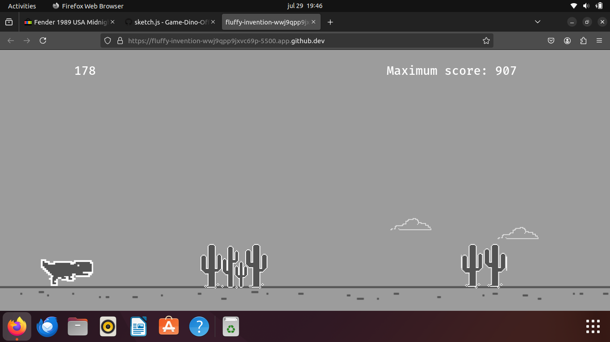
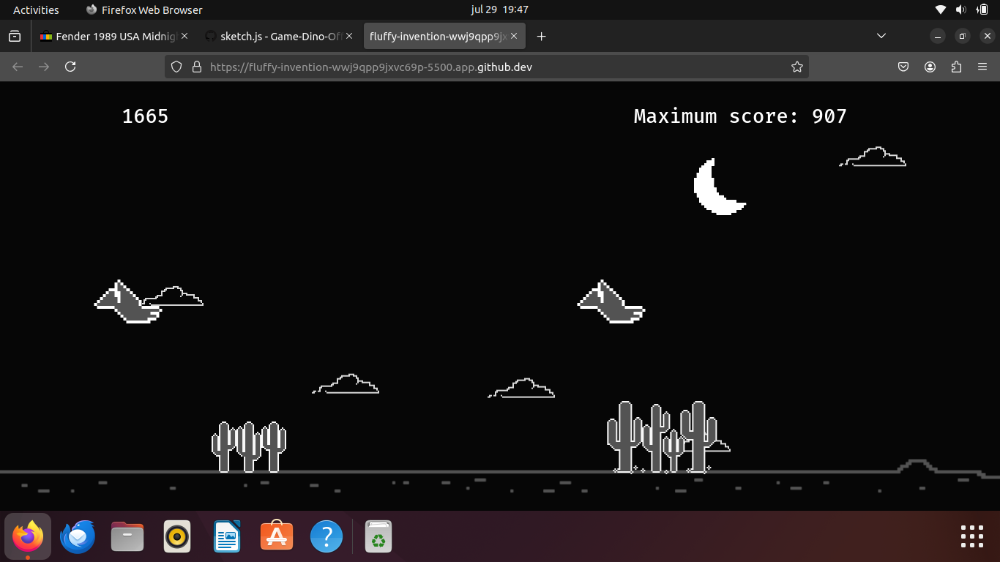

# Game-Dino-Offline

A Google dinosaur game clone that I made using javascript, the p5play librarie and also electron.

Here you can play it: **https://vilirocha.github.io/Game-Dino-Offline/**

Includes features such as:

- The ability to jump and sprint with the dinosaur.
- On ground and flying obstacles.
- Getting faster the longer the dinosaur stays alive.
- Simple interface with score and score record.
- Sound effects for jumping and dying.
- Day and night cycle.

## Game images:

